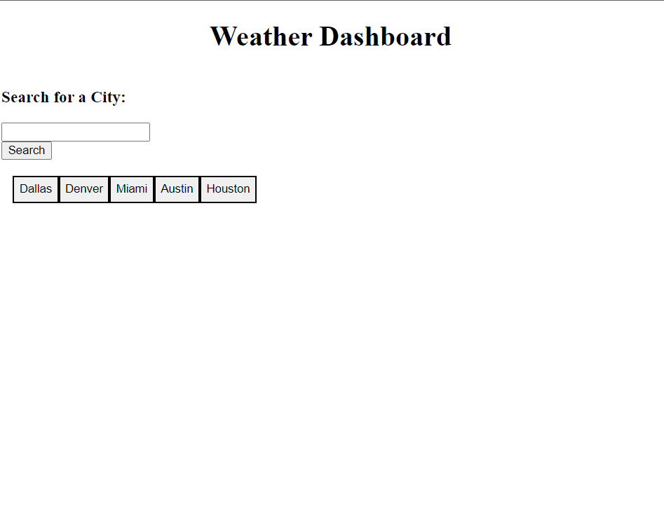

# Weekly-Weather-Checks

## Description
Provide a short description explaining the what, why, and how of your project. Use the following questions as a guide:
- What was your motivation?
    - To create a weather dashboard in hope of seeing forcasts for weather conditions.
- Why did you build this project? (Note: the answer is not "Because it was a homework assignment.")
    - Wanted to gain proficiency with JavaScript and utilize the API concepts to further advance my knowledge of JS.
- What problem does it solve?
    - Being able to see the forcasted weather of any city and retain information for those cities at my personal whim.
- What did you learn?
    - I need to practice more. And inputing APIs are a difficult task.

## Installation
What are the steps required to install your project? Provide a step-by-step description of how to get the development environment running.
- Create a github repo with a unique name
- clone the https github repo URL into git using the git clone function
type in "code ." into git once the repo is saved on your computer
- VSCode will pop up onto your desktop and within VSCode you have the ability to edit and save committed material within VSCode.
- This is communicating with Git when you are complete with changes utilize "git add ." to sync all changes
- Use "git commit -m "enter commit messages" to commit the changes into git
- Use "git push origin main" as the final push into github where you will see all of your saved changes and a copy of the code

## Usage
Provide instructions and examples for use. Include screenshots as needed.
- Github: https://github.com/AmberDiehl1/Weekly-Weather-Checks
- Website: 

To add a screenshot, create an `assets/images` folder in your repository and upload your screenshot to it. Then, using the relative filepath, add it to your README using the following syntax:

 

## Credits
List your collaborators, if any, with links to their GitHub profiles.
